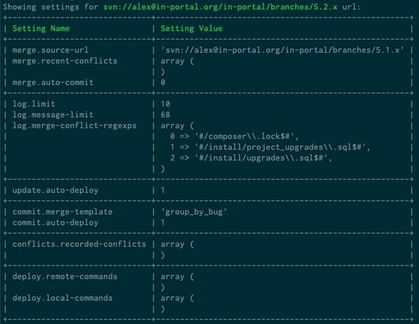

# SVN-Buddy

[](https://github.com/console-helpers/svn-buddy/actions?query=workflow%3ACI)
[](https://codecov.io/gh/console-helpers/svn-buddy)
[](https://scrutinizer-ci.com/g/console-helpers/svn-buddy/?branch=master)


[](https://packagist.org/packages/console-helpers/svn-buddy)
[](https://packagist.org/packages/console-helpers/svn-buddy)
[](https://packagist.org/packages/console-helpers/svn-buddy)

SVN-Buddy is a command-line tool, that was created to drastically simplify Subversion-related development tasks performed on a daily basis from command line.

The Git users will also feel right at home, because used terminology (commands/options/arguments) was inspired by Git.

## Usage

Almost each of commands described below accepts `path` argument to specify working copy path. This allows to work with several working copies without the need to `cd` to each of them.

### The "config" (alias "cfg") command

This command allows to change configuration settings, that are used by other commands.

Some of the commands (`merge`, `log`, `conflicts` and `aggregate`) also use central data store (located in `~/.svn-buddy/config.json` file) to store information about a working copy.

* If nothing is stored for a given working copy, then a global default would be used.
* If global default is missing, then built-in default would be used.
* Both working copy and global settings are configurable.

The association between setting values and a working copy is done using working copy url. Such approach allows to preserve setting values, when working copy is moved to different location on disk.

#### Arguments
 * `path` - Working copy path [default: "`.`"]

#### Options
 * `-s`, `--show=SETTING` - Shows only given (instead of all) setting value
 * `-e`, `--edit=SETTING` - Change setting value in the Interactive Editor
 * `-d`, `--delete=SETTING` - Delete setting
 * `-g`, `--global` - Operate on global instead of working copy-specific settings

#### Examples

Feel free to add `--global` option to any of examples below to operate on global settings instead of working copy ones.

```
svn-buddy.phar config
```

Shows values of all settings in current working copy grouped by a command:



```
svn-buddy.phar config --show merge.source-url
```

Shows value of a `merge.source-url` setting:


```
svn-buddy.phar config --edit merge.source-url
```

Change value of a `merge.source-url` setting using interactive editor.

```
svn-buddy.phar config --delete merge.source-url
```

Delete a `merge.source-url` setting.

### The "log" command

This command shows the log messages for a set of revisions.

What makes this command really shine (compared to `svn log` command) is:

* speed - the revision information from repository is cached locally and therefore it's accessed blazingly fast
* revision search - revisions can not only be found by path and number, but also using ref (e.g. `trunk` or `tags/stable`) and a bug number
* revision filtering - when found, revisions can be filtered further by their merge status (merged, not merged, is merge revision by itself)
* detailed revision information - different information about revision is available and can be shown using set of built-in views: compact view, summary view, detailed view, merge conflict prediction view, merge status view

The revision is considered merged only, when associated merge revision can be found. Unfortunately Subversion doesn't create merge revisions on direct path operations (e.g. replacing `tags/stable` with `trunk`) and therefore affected revisions won't be considered as merged when using this command.

Bugs, associated with each revision, are determined by parsing [bugtraq:logregex](https://tortoisesvn.net/docs/release/TortoiseSVN_sk/tsvn-dug-bugtracker.html) Subversion property at the root folder of last changed ref in a project. The assumption is made, that Subversion project won't move to a different issue tracker and therefore value of `bugtraq:logregex` Subversion property is cached forever.

The working copy revision row is highlighted in bold in revision list to ease identifying of outdated working copies.

#### Arguments

* `path` - Working copy path or URL [default: "`.`"]

#### Options

* `-r`, `--revisions=REVISIONS` - List of revision(-s) and/or revision range(-s), e.g. `53324`, `1224-4433`
* `-b`, `--bugs=BUGS` - List of bug(-s), e.g. `JRA-1234`, `43644`
* `--refs=REFS` - List of refs, e.g. `trunk`, `branches/branch-name`, `tags/tag-name` or `all` for all refs
* `--merges` - Show merge revisions only
* `--no-merges` - Hide merge revisions
* `--merged` - Shows only revisions, that were merged at least once
* `--not-merged` - Shows only revisions, that were not merged
* `--merged-by=MERGED-BY` - Show revisions merged by list of revision(-s) and/or revision range(-s)
* `--action=ACTION` - Show revisions, whose paths were affected by specified action, e.g. `A`, `M`, `R`, `D`
* `--kind=KIND` - Show revisions, whose paths match specified kind, e.g. `dir` or `file`
* `--author=AUTHOR` - Show revisions, made by a given author
* `-f`, `--with-full-message` - Shows non-truncated commit messages
* `-d`, `--with-details` - Shows detailed revision information, e.g. paths affected
* `-s`, `--with-summary` - Shows number of added/changed/removed paths in the revision
* `--with-refs` -  Shows revision refs
* `--with-merge-oracle` - Shows number of paths in the revision, that can cause conflict upon merging
* `--with-merge-status` - Shows merge revisions affecting this revision
* `--max-count=MAX-COUNT` - Limit the number of revisions to output
* `-a`, `--aggregate` - Aggregate displayed revisions by bugs

#### Configuration settings

* `log.limit` - maximal number of displayed revisions (defaults to `10`)
* `log.message-limit` - maximal width (in symbols) of `Log Message` column (defaults to `68`)
* `log.merge-conflict-regexps` - list of regular expressions for path matching inside revisions ( used to predict merge conflicts, when `--with-merge-oracle` option is used)

#### Examples

By default ref (e.g. `trunk`) to display revisions for is detected from current working copy. To avoid need to keep different working copies around add `--refs X` (e.g. `--refs branches/branch-name`) to display revisions from specified ref(-s) of a project.

All `--with-...` options can be combined together to create more complex views.

```
svn-buddy.phar log
```

Displays all revisions without filtering:


* the number of displayed revisions is always limited to value of `log.limit` configuration setting
* the total number revisions is also displayed (when relevant) to indicate how much more revisions aren't shown

```
svn-buddy.phar log --max-count 5
```

Displays all revisions without filtering, but limited by `--max-count` option value.

```
svn-buddy.phar log --revisions 10,7,34-36,3
```

Displays `3`, `7`, `10`, `34`, `35` and `36` revisions. Any combination of revision(-s)/revision range(-s) can be used.

```
svn-buddy.phar log --bugs JRA-10,6443
```

Displays revisions associated with `JRA-10` and `6443` bugs.

```
svn-buddy.phar log --refs branches/5.2.x,releases/5.2.1
```

Displays revisions retrieved from `branches/5.2.x` and `releases/5.2.1` refs. The valid refs formats are:

* `trunk`
* `branches/branch-name`
* `tags/tag-name`
* `releases/release-name`

```
svn-buddy.phar log --refs all
```

Displays revisions retrieved from all refs in a project.

```
svn-buddy.phar log --action D
```

Displays revisions, where at least one path (directory or file) was deleted.

```
svn-buddy.phar log --kind dir
```

Displays revisions, where at least one affected path was a directory.

```
svn-buddy.phar log --action D --kind dir
```

Displays revisions, where at least one affected path was a directory at least one path (directory or file) was deleted, but this isn't guaranteed to be the same path.

```
svn-buddy.phar log --merges
```

Displays only merge revisions.

```
svn-buddy.phar log --no-merges
```

Displays all, but merge revisions.

```
svn-buddy.phar log --merged
```

Displays only merged revisions.

```
svn-buddy.phar log --not-merged
```

Displays all, but merged revisions.

```
svn-buddy.phar log --merged-by 12,15-17
```

* Displays revisions merged by `12`, `15`, `16` and `17` revisions.

```
svn-buddy.phar log --with-full-message
```

The log message won't be truncated in displayed revision list.

```
svn-buddy.phar log --with-details
```

Displays detailed information about revisions:


```
svn-buddy.phar log --with-summary
```

Compact alternative to `--with-details` option where only totals about made changes in revisions are shown in separate column:


```
svn-buddy.phar log --with-refs
```

Displays refs, affected by each revision:


```
svn-buddy.phar log --with-merge-oracle
```

Shows how much paths in each revision can (but not necessarily will) cause conflicts when will be merged:


The `log.merge-conflict-regexps` configuration setting needs to be specified before Merge Oracle can be used. This can be done using following commands:

* globally: `svn-buddy.phar config --edit log.merge-conflict-regexps --global`
* in a working copy: `svn-buddy.phar config --edit log.merge-conflict-regexps`

Once Interactive Editor opens enter regular expression (one per line) used to match a path (e.g. `#/composer\\.lock$#` matches to a `composer.lock` file in any sub-folder).

In above image there are 2 revisions and each of them contain 1 path (detected using configuration setting defined above) that might result in a conflict.

```
svn-buddy.phar log --with-merge-oracle --with-details
```

Displays changed paths in each revision, but also highlights potentially conflicting paths (from merge oracle) with red:


```
svn-buddy.phar log --with-merge-status
```

For each displayed revision also displays revision responsible for merging it (with merge revision ref):


### The "merge" command

This command merges changes from another project or ref within same project into a working copy.

The merges performed outside of SVN-Buddy are detected automatically (thanks to `svn mergeinfo` being used internally).

#### Arguments

* `path` - Working copy path [default: "`.`"]

#### Options

* `--source-url=SOURCE-URL` - Merge source url (absolute or relative) or ref name, e.g. `branches/branch-name`
* `-r`, `--revisions=REVISIONS` - List of revision(-s) and/or revision range(-s) to merge, e.g. `53324`, `1224-4433` or `all`
* `--exclude-revisions=EXCLUDE-REVISIONS` - List of revision(-s) and/or revision range(-s) not to merge, e.g. `53324`, `1224-4433`
* `-b`, `--bugs=BUGS` - List of bug(-s) to merge, e.g. `JRA-1234`, `43644`
* `--exclude-bugs=EXCLUDE-BUGS` - List of bug(-s) not to merge, e.g. `JRA-1234`, `43644`
* `--merges` - Show merge revisions only
* `--no-merges` - Hide merge revisions
* `-f`, `--with-full-message` - Shows non-truncated commit messages
* `-d`, `--with-details` - Shows detailed revision information, e.g. paths affected
* `-s`, `--with-summary` - Shows number of added/changed/removed paths in the revision
* `--update-revision=UPDATE-REVISION` - Update working copy to given revision before performing a merge
* `--auto-commit=AUTO-COMMIT` - Automatically perform commit on successful merge, e.g. `yes` or `no`
* `--record-only` - Mark revisions as merged without actually merging them
* `--reverse` - Rollback previously merged revisions
* `-a`, `--aggregate` - Aggregate displayed revisions by bugs
* `-p`, `--preview` - Preview revisions to be merged

#### Configuration settings

* `merge.source-url` - the default url to merge changes from
* `merge.auto-commit` - whatever to automatically perform a commit on successful merge (used, when `--auto-commit` option not specified)

#### Examples

The `--source-url` option can be used with any of below examples to merge from that url instead of guessing it. The source url can be specified using:

* absolute url: `svn://domain.com/path/to/project/branches/branch-name`
* relative url: `^/path/to/project/branches/branch-name`
* ref: `branches/branch-name` or `tags/tag-name` or `trunk`

```
svn-buddy.phar merge
```

The above command does following:

1. only, when `--source-url` option isn't used
 * detects merge source url
 * when not detected ask to use `--source-url` option to specify it manually
 * when detected, then store it into `merge.source-url` configuration setting
2. determines unmerged revisions between working copy and detected merge source url
3. displays the results (no merge is performed):
 * number of unmerged revisions/bugs
 * status of previous merge operation
 * list of unmerged revisions


```
svn-buddy.phar merge --revisions 5,3,77-79
```

Does all of above and attempts to merge specified revisions into a working copy. As the merge progresses the output of `svn merge` command is shown back to user in real-time (no buffering).

Revisions are merged one by one, because:

* the results are displayed back to user much faster, then when merging several revisions in one go
* conflict resolution is much easier, because exact revision that caused conflict is already known

The specified revisions to be merged are automatically sorted chronologically.


Only 2 outcomes from above command execution are possible:

* the merge was successful - nothing extra, except `svn merge` command output is displayed
* the conflict happened during the merge or conflicting path existed prior the merge - the above shown error screen is displayed and conflicted paths are stored in `conflicts.recorded-conflicts` configuration setting

The error screen shows:

* the `svn merge` command output (if was executed)
* the list of conflicted paths
* for each path the list of non-merged revisions prior to merged one, that are affecting the conflicted path are displayed

The last bit can be quite helpful, when for example merging revision that changes a file, but not merging one before it, where this file was created.

After the merge conflict was solved the same merge command can be re-run without need to remove already merged revisions from `--revisions` option value.

Can't be used together with `--bugs` option.

```
svn-buddy.phar merge --revisions all
```

Will merge all non-merged revisions.

```
svn-buddy.phar merge --bugs JRA-4343,3453
```

Will merge all revisions, that are associated with `JRA-4343` and `3453` bugs. This would be a major time saver in cases, when:

* only bug number is known
* bug consists of multiple revisions created on different days

Can't be used together with `--revisions` option.

```
svn-buddy.phar merge --auto-commit yes
```

Will automatically run `svn-buddy.phar commit` command on successful merge. Overrides value from `merge.auto-commit` config setting.

```
svn-buddy.phar merge --auto-commit no
```

Don't automatically run `svn-buddy.phar commit` command, when merge was successful. Overrides value from `merge.auto-commit` config setting.

```
svn-buddy.phar merge --with-full-message
```

Thanks to `log` command being used behind the scenes to display non-merged revisions it's possible to forward `--with-full-message` option to it to see non-truncated log message for each revision.

```
svn-buddy.phar merge --with-details
```

Thanks to `log` command being used behind the scenes to display non-merged revisions it's possible to forward `--with-details` option to it to see paths affected by each non-merged revision.


```
svn-buddy.phar merge --with-summary
```

Thanks to `log` command being used behind the scenes to display non-merged revisions it's possible to forward `--with-summary` option to it to see totals for paths affected by each non-merged revision.

```
svn-buddy.phar merge --update-revision 55
```

Will update working copy to the 55th revision before starting merge. Can be used to replay older merges for analytical purposes.

```
svn-buddy.phar merge --bugs JRA-123 --record-only
```

Will mark revisions, associated with `JRA-123` bug as merged (no files will be changed).

```
svn-buddy.phar merge --revisions 55 --record-only
```

Will mark 55th revision as merged (no files will be changed).

### The "commit" (alias "ci") command

The command sends changes from your working copy to the repository.

#### Arguments

* `path` - Working copy path [default: "`.`"]

#### Options

* `--cl` - Operate only on members of selected changelist
* `--merge-template=MERGE-TEMPLATE` Use alternative merge template for this commit
* `-d`, `--deploy` - Perform remote deployment after a successful commit

#### Configuration settings

* `commit.merge-template` - log message template for merge commits (defaults to `group_by_revision`)

#### Examples

```
svn-buddy.phar commit
```

The command workflow is following:

1. abort automatically, when
 * non-resolved conflicts are present
 * no paths are changed
2. open an Interactive Editor for commit message entry
3. commit message is automatically generated, from:
 * selected changelist name (when `--cl` option was used)
 * merged revision information using selected merge template (when this is a merge commit)
 * list of conflicted paths (if conflicts were present, but later were resolved)
4. once user is done changing commit message a confirmation dialog is shown to ensure user really wants to perform commit
5. when user agreed previously the commit is made

The auto-generated commit message looks like this (with `group_by_revision` merge template):

```
Changelist Name
Merging from Trunk to Stable
* r22758: message line 1
message line 2
message line 3
message line 4
* r22796:  message line 1
message line 2
message line 3

Conflicts:
  * path/to/conflicted-file
```

Description:

* `Trunk` is folder name of merge source url
* `Stable` is folder name of merge target (working copy)
* `22758` and `22796` are merged revisions
* `message line ...` are lines from commit message of merged revisions

```
svn-buddy.phar commit --cl
```

Same as above, but will also:

* ask user to select changelist
* put changelist name in commit message

```
svn-buddy.phar commit --merge-template summary
```

Same as above, but will use `summary` merge template instead of merge template configured for this working copy.

```
svn-buddy.phar commit --deploy
```

Perform a remote deployment after commit was performed or there is nothing to commit.


### The "cleanup" command

Recursively clean up the working copy, removing locks, resuming unfinished operations, etc.

#### Arguments

* `path` - Working copy path [default: "`.`"]

#### Examples

```
svn-buddy.phar cleanup
```

### The "revert" command

Restore pristine working copy file (undo most local edits).

#### Arguments

* `path` - Working copy path [default: "`.`"]

#### Examples

```
svn-buddy.phar revert
```

### The "update" (alias "up") command

Bring changes from the repository into the working copy.

#### Arguments

* `path` - Working copy path [default: "`.`"]

#### Options

* `-r`, `--revision=REVISION` - Update working copy to specified revision, e.g. `NUMBER`, `{DATE}`, `HEAD`, `BASE`, `COMMITTED`, `PREV`
* `--ignore-externals` - Ignore externals definitions
* `-d`, `--deploy` - Perform local deployment after a successful update

#### Examples

```
svn-buddy.phar update
```

Updates a working copy.

```
svn-buddy.phar update --revision 55
```

Updates a working copy to 55th revision.


```
svn-buddy.phar update --ignore-externals
```

Updates a working copy, but doesn't checkout externals.

```
svn-buddy.phar update --deploy
```

Perform a local deployment after update was performed or there is nothing to update.

### The "conflicts" (alias "cf") command

Manages recorded conflicts in a working copy.

#### Arguments

* `path` - Working copy path [default: "`.`"]

#### Options

* `-m`, `--mode=MODE` - Operation mode, e.g. `show`, `add`, `replace`, `erase` [default: "`show`"]

#### Configuration settings

* `conflicts.recorded-conflicts` - list of conflicted paths (maintained automatically)

#### Examples

```
svn-buddy.phar conflicts
```

Shows list of recorded conflicts like this:

```
Conflicts:
 * conflicted/path/one
 * conflicted/path/tow
```

```
svn-buddy.phar conflicts --mode show
```

Shows list of recorded conflicts like this:

```
Conflicts:
 * conflicted/path/one
 * conflicted/path/tow
```

```
svn-buddy.phar conflicts --mode add
```

Adds current conflicted paths (e.g. after merge or update) to the list of recorded paths.

```
svn-buddy.phar conflicts --mode replace
```

Replaced list of recorded paths with current conflicted paths (e.g. after merge or update).

```
svn-buddy.phar conflicts --mode erase
```

Forgets all recorded conflicted paths.

### The "search" command

Searches for a revision, where text was added to a file or removed from it.

#### Arguments

* `path` -  File path
* `keywords` - Search keyword

#### Options

* `-t`, `--match-type=MATCH-TYPE` - Match type, e.g. `first` or `last` [default: "`last`"]

#### Examples

```
svn-buddy.phar search folder/path.php "on testMethod("
```

Finds where `testMethod` method was last seen in the `folder/path.php` file in the working copy.

```
svn-buddy.phar search folder/path.php "on testMethod(" --match-type last
```

Finds where `testMethod` method was last seen in the `folder/path.php` file in the working copy.

```
svn-buddy.phar search folder/path.php "on testMethod(" --match-type first
```

Finds where `testMethod` method was first added in the `folder/path.php` file in the working copy.

### The "aggregate" command

Runs other command sequentially on every working copy on a path. Almost all other commands can be used in such a manner.

#### Arguments

* `sub-command` - Command to execute on each found working copy
* `path` - Path to folder with working copies [default: "`.`"]

#### Own options

* `--ignore-add=IGNORE-ADD` - Adds path to ignored directory list
* `--ignore-remove=IGNORE-REMOVE` - Removes path to ignored directory list
* `--ignore-show` - Show ignored directory list

#### Aggregated command options

* `-d`, `--with-details` - Shows detailed revision information, e.g. paths affected
* `-s`, `--with-summary` - Shows number of added/changed/removed paths in the revision
* `--merges` - Show merge revisions only
* `--no-merges` - Hide merge revisions
* `--merged` - Shows only revisions, that were merged at least once
* `--not-merged` - Shows only revisions, that were not merged
* `--action=ACTION` - Show revisions, whose paths were affected by specified action, e.g. `A`, `M`, `R`, `D`
* `--kind=KIND` - Show revisions, whose paths match specified kind, e.g. `dir` or `file`
* `--author=AUTHOR` - Show revisions, made by a given author
* `-f`, `--with-full-message` - Shows non-truncated commit messages
* `--with-refs` - Shows revision refs
* `--with-merge-oracle` - Shows number of paths in the revision, that can cause conflict upon merging
* `--with-merge-status` - Shows merge revisions affecting this revision
* `--max-count=MAX-COUNT` - Limit the number of revisions to output
* `--ignore-externals` - Ignore externals definitions
* `--refresh-bug-tracking` - Refreshes value of "bugtraq:logregex" SVN property of the project
* `--show-meta` - Shows meta information of a project

#### Configuration settings

* `aggregate.ignore` - list of paths ignored by `aggregate` command, when searching for working copies

#### Examples

```
svn-buddy.phar aggregate --ignore-add some-path
```

Adds `some-path` path (can be relative or absolute) to ignored path list.

```
svn-buddy.phar aggregate --ignore-remove some-path
```

Removes `some-path` path (can be relative or absolute) from ignored path list.

```
svn-buddy.phar aggregate --ignore-show
```

Shows list of ignored paths.

### The "project" command

Changes and displays project configuration.

#### Arguments

* `path` - Working copy path [default: "`.`"]


#### Options

* `--refresh-bug-tracking` - Refreshes value of "bugtraq:logregex" SVN property of the project
* `--show-meta` - Shows meta information of a project

#### Examples

```
svn-buddy.phar project --refresh-bug-tracking
```

Pulls `bugtraq:logregex` SVN property from recently modified trunk/branch/tag and stores into project configuration.

```
svn-buddy.phar project --show-meta
```

Displays project meta information in following format:


### The "reparse" command

CReparses given revision.

#### Arguments

* `path` - Working copy path [default: "`.`"]


#### Options

* `-r`, `--revision=REVISION` - Reparse specified revision


#### Examples

```
svn-buddy.phar reparse --revision 12345
```

Re-reads and reparses 12345 revision information.


### The "self-update" command

Updates application to most recent version. Following update channels are available:

* `stable` (default) - new version available eventually
* `snapshot` - new version available on monday (only, when something was changed)
* `preview` - new version available once per day (only, when something was changed)

Special options exist (see examples below) to switch between update channels.

#### Options

* `-r`, `--rollback` - Revert to an older version of the application
* `--stable` - Force an update to the stable channel
* `--snapshot` - Force an update to the snapshot channel
* `--preview` - Force an update to the preview channel

#### Examples

```
svn-buddy.phar self-update
```

Updates to most recent version on current update channel. By default update would happen from `stable` channel.

```
svn-buddy.phar self-update --rollback
```

In case if update was done previously allows to undo the update.

```
svn-buddy.phar self-update --stable
```

Change current update channel to `stable` and immediately performs the update.

```
svn-buddy.phar self-update --snapshot
```

Change current update channel to `snapshot` and immediately performs the update.

```
svn-buddy.phar self-update --preview
```

Change current update channel to `preview` and immediately performs the update.

### The "list" command

Displays available commands. The version of Subversion binary is also displayed next to application version.

#### Examples

```
svn-buddy.phar
svn-buddy.phar list
```

### The "changelog" command

Displays changes included in the current SVN-Buddy release.

#### Examples

```
svn-buddy.phar changelog
```

### The "deploy" command

This command deploys changes to remote/local server.

#### Arguments

* `path` - Working copy path [default: "`.`"]

#### Options

* `-r`, `--remote` - Performs remote deployment
* `-l`, `--local` - Performs local deployment

#### Configuration settings

* `deploy.remote-commands` - commands to be executed during the remote deployment (one command per line)
* `deploy.local-commands` - commands to be executed during the local deployment (one command per line)

#### Examples

```
svn-buddy.phar deploy --remote
```

Will perform remote deployment.

```
svn-buddy.phar deploy --local
```

Will perform local deployment.


### The "help" command

Displays help for a command.

## Installation

1. [download](https://github.com/console-helpers/svn-buddy/releases/latest/download/svn-buddy.phar) a stable release (preferably to the folder in PATH)
2. setup auto-completion by placing `eval $(/path/to/svn-buddy.phar _completion --generate-hook -p svn-buddy.phar)` in `~/.bashrc` (Bash v4.0+ required) and reopening a Terminal window
3. (optional) switch to the `snapshot` release channel to get weekly updates by running the `/path/to/svn-buddy.phar self-update --snapshot` command
4. (optional) switch to the `preview` release channel to get daily updates by running the `/path/to/svn-buddy.phar self-update --preview` command

How to upgrade Bash on macOS: https://www.shell-tips.com/mac/upgrade-bash/ .

## Requirements

* working Subversion command-line client (was tested on v1.6, v1.7, v1.8)
* a Subversion working copy (almost all `svn-buddy.phar` commands operate inside a working copy)

## Contributing

See [CONTRIBUTING](CONTRIBUTING.md) file.

## License

SVN-Buddy is released under the BSD-3-Clause License. See the bundled [LICENSE](LICENSE) file for details.
